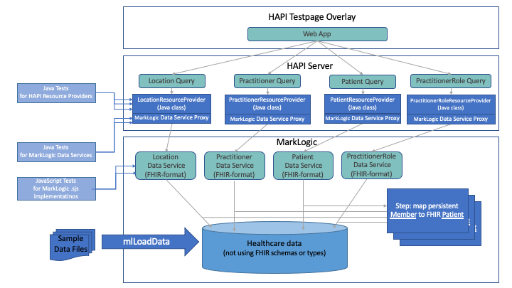

# FHIR Mapper Project

This project is a demonstration on how to serve FHIR directly out of your MarkLogic database to satisfy an interoperability requirement without standing up a dedicated database. This is achieved by linking a HAPI server to Data Services that live on the MarkLogic server that perform the requested searches and transform the persistent data into a FHIR record using a DHF Mapping Step.

The HAPI server we have implemented here only shows how to set up MarkLogic as the backend storage solution for a read only HAPI server. We have not included how to set up the rest of a fully compliant FHIR server with things like OAuth authentication or pathent authorization to share data with a provider.

## Architecture and flow

This project bundles A HAPI server and HAPI Test Overlay with a sample MarkLogic project that maps data to the FHIR format, and supports FHIR queries.

The HAPI server contains mostly code from the HAPI project; the only new code we provide are the custom implementations of IResourceProvider which are query adapters for the Marklogic data services that provide FHIR-compliant data.

The MarkLogic component contains:
* Sample data in non-FHIR formats. While different from your data in your database, these are needed to illustrate the techniques and libraries provided here.
* Data Services for each FHIR resource type which allow a caller to query for data using FHIR search criteria and return data in FHIR format. As always, there is a service implementation in .sjs as well as a genterated Java proxy class to call the service from Java.
* Mapping Steps which convert from the persistent, sample data format to FHIR-compliant JSON. 
  * NOTE that these are not run in the typical Data Hub way (they are never executed in a flow during ingest) and instead these are used by Data Services to map data at query time. 
* Unit tests to verify MarkLogic and HAPI services, and to illustrate how to test in a FHIR-mapper project at various layers in the architecture.



## When to use this project
The FHIR Mapper project can be customized to serve FHIR directly out of your Operational Data Store; it provides sample data and services that serve as a blueprint to follow when implementing your services on your data. When you are implemeting the FHIR server capabilities for your own data, remember that the FHIR Mapper assumes that you already have data in a clean and canonical form, so you will have used Data Hub Framework or another technique to get the data into that form.

For projects where there is no existing database and schema, we recommend using the [MarkLogic Healthcare Starter Kit](https://github.com/marklogic-community/marklogic-healthcare-starter-kit), which persists data in a FHIR-like data schema. This project is specialized for cases where you have your own persistent schema that must be converted to FHIR at at egress/query time.

For instructions on how to integrate the FHIR Mapper into your existing ODS project, see the Cook Book.

## Trying the Demo Project

### Deploy to MarkLogic

To deploy the application to a fresh ML server, run ```./gradlew mlDeploy``` from the ```fhir-mapping``` folder.

### Load Example Data
To load the sample set of data that comes with the project (in ```src/main/ml-data```), run ```./gradlew mlLoadData``` from the ```fhir-mapping``` folder.

### Run HAPI Server
To run the HAPI server that connects to and queries data from the project you just deployed, run ```./gradlew bootRun``` from the ```hapi-server``` folder.

### Viewing the data in the HAPI Overlay
Navigate to http://localhost:8081 to bring up a HAPI test page.

#### Note about PractitionerRoles
The PractitionerRole date type was included in the project to show the handling of ```_include``` and ```_revinclude``` query parameters. The data is not fully mapped into the FHIR resource.

#### Example queries
- From the [Pracitioner query page](http://localhost:8081/resource?serverId=home&pretty=false&_summary=&resource=Practitioner), search for ```family``` name ```Doe```. You should get 2 Practitioner results back (John and Jane Doe).
- From the [Patient query page](http://localhost:8081/resource?serverId=home&pretty=false&_summary=&resource=Patient), search for ```given``` name ```Jake```. You should get 1 Patient result back (Jake Jacobs).

#### Known Issues in the HAPI Overlay

- ```OperationDefinition``` is displayed as a resource type that can be interacted with even though the server does not support it
- The ```Practitioner``` search page gives an option to ```Include``` the relationship ```PractitionerRole:practitioner```. This will cause an error if slected because the server (and the spec) is expecting ```PractitionerRole:practitioner``` to be a ```ReverseInclude```. If you modify the search that is performed to have ```_revinclude```, instead of ```_include``` the server will respond as expected.

These issues are most likely caused by the fact that we copied the overlay into our project by hand instead of using the maven overly capabilities because this is a gradle project. A possible workaround is to stand up a HAPI Overlay server in it's own project and configure it to communicate with the FHIR server that is run in the hapi-server project.

See HAPI documentation about the Web Testpage Overlay [here]( https://hapifhir.io/hapi-fhir/docs/server_plain/web_testpage_overlay.html ). 

## Running the Example Unit Tests
There are 3 types of tests in the Demo Project:

- JS unit tests to test the server side code
- Java tests to test and demostrate the use of the Data Service Proxy Classes
- Java tests to test the HAPI resource providers

Below are instructions to view and run each of these tests.

### JS Unit Tests
The JavaScript tests are MarkLogic .sjs modules located in ```fhir-mapping/src/test/ml-modules/root/test``` and are run using the marklogic-unit-test libraries. 

Note: Running these tests will clear the database and load test specific data. If you want to use the HAPI server to view FHIR records or run the other tests, you will need to load the example data again.

#### Running From Commandline
To execute the JavaScript tests, run ```./gradelw mlUnitTest``` in the ```fhir-mapping``` directory. This will run the tests and display some basic PASS/FAIL information. To see more details about a given test, run them from the test UI.

#### Running From Test UI
To execute the JavaScript tests from a UI, visit [http://localhost:8011/test/default.xqy] and select the test you want to run from the list.

### Data Service Proxy Tests
The tests of the Data Service Proxies are located in ```fhir-mapping/src/test/java```. These test [MarkLogic Data Services] (https://docs.marklogic.com/guide/java/DataServices) by invoking the generated Java proxies.

#### Running the Tests
To execute the Data Service tests, run ```./gradelw test``` in the ```fhir-mapping``` directory. This will run the tests using JUnit. To View more details about the test results see the report that JUnit generates by opening ```fhir-mapping/build/reports/tests/test/index.html``` in a browser.

### HAPI Resource Provider Tests
The tests of the ResourceProvider implementations are located in ```hapi-server/src/test/java```. These test our implementations of [IResourceProvider] (https://hapifhir.io/hapi-fhir/apidocs/hapi-fhir-server/ca/uhn/fhir/rest/server/IResourceProvider.html) which in turn call MarkLogic Data Service Proxy classes.

#### Running the Tests
To execute the Resource Provider tests, run ```./gradelw test``` in the ```hapi-server``` directory. This will run the tests using JUnit. To View more details about the test results see the report that JUnit generates by opening ```hapi-server/build/reports/tests/test/index.html``` in a browser.

## Extending and Adapting
See the included Cookbook.md guide to extend and integrate this project with your data or existing project.